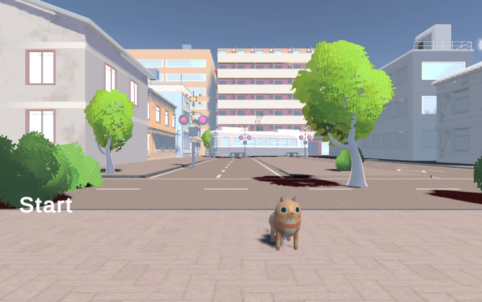
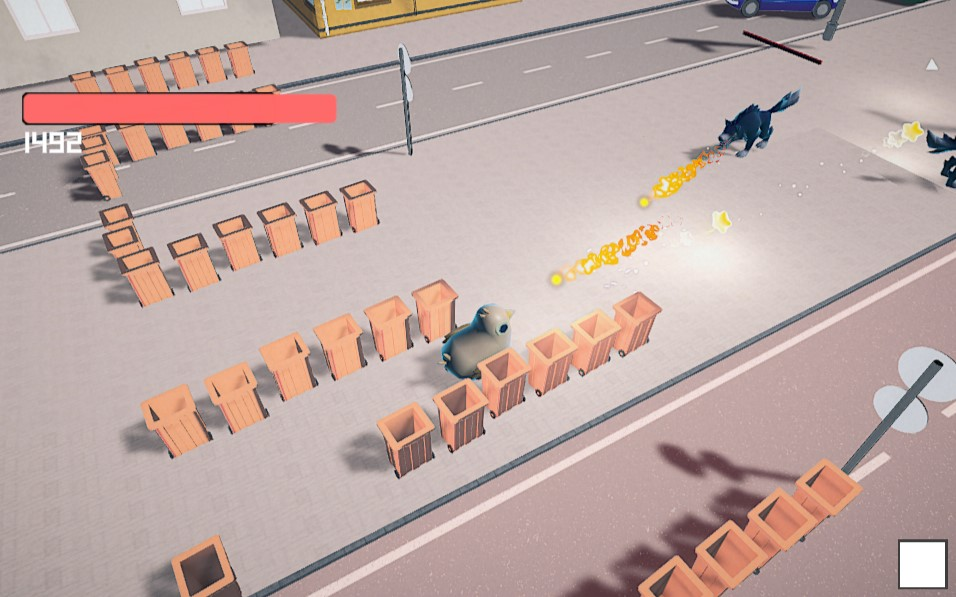
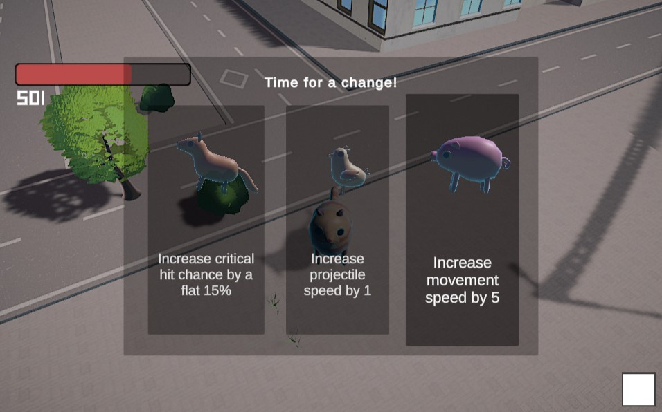

# Untitiled Cat Game

## About
Game about a cat that was minding its own business, when suddenly monsters started attacking!!!!! Luckily, every 10 seconds the cat can pick a friend with a random powerup (but so do the enemies...)

## Controls
**Point** and **click** (or **hold**) to shoot at the baddies.
**WASD** to move around the map.
**Escape** for when you inevitably fall off the map.

## Enemy Types
### Blossom 
A machine gunner flower. Will shoot you 100 times a second for fun. Fortunately immobile as hell, and those bullets don't do too much.  
### Fire Dragon
Fairly standard, with a higher HP. Not much to write home about. Will happily function as a home heater for UK based players this winter.  
### Snake
Sneaky, Slow and Strong. Strongest individual attacks, but very weak defensively. Slightly harder to hit due to their small size.  
### Wolf
Woof. Woof Woof. Woof? (Most mobile foe. Can't attack often). 

## Very Cool Screenshots

### Menu

### Running and Shooting

### Upgrading

### Credits

* TheJonu (@thejonu)
* mxbi (@mxbi)
* killiyun (@killiyun)
* Unknownlocal (@unknownlocal)
* edgeboyo (@edgeboyo)

### Attribution

*  Background Music: Exit the Premises by Kevin MacLeod (https://www.chosic.com/download-audio/39329/)
* 3D Models from various Unity Asset Store packages

### Fixes

* 04/10/22 - Fixed UI elements not allowing to restart the level. Fixed crashes caused by Player death
